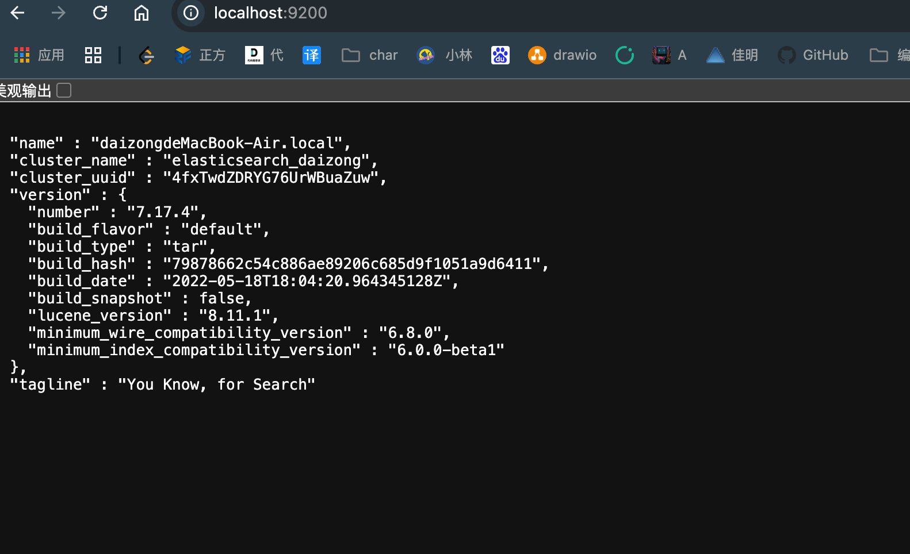

## 启动es


```
brew tap elastic/tap

brew install elasticsearch-full

brew services start elastic/tap/elasticsearch-full // 启动
```

打开浏览器并访问 `http://localhost:9200`，如果看到如下信息，说明 Elasticsearch 正在运行：



#### 可视化工具Kibana

```
bashCopy Codebrew tap elastic/tap
brew install elastic/tap/kibana-full
brew services start elastic/tap/kibana-full // 	启动
```

Kibana 默认在`http://localhost:5601` 5601 端口上运行。你可以通过浏览器访问：

### 安装 `elasticsearch-head`

git clone https://github.com/mobz/elasticsearch-head.git 

cd elasticsearch-head


npm install

npm run start

或许要配置跨域问题

https://www.elastic.co/guide/en/elasticsearch/client/java-api-client/current/index.html